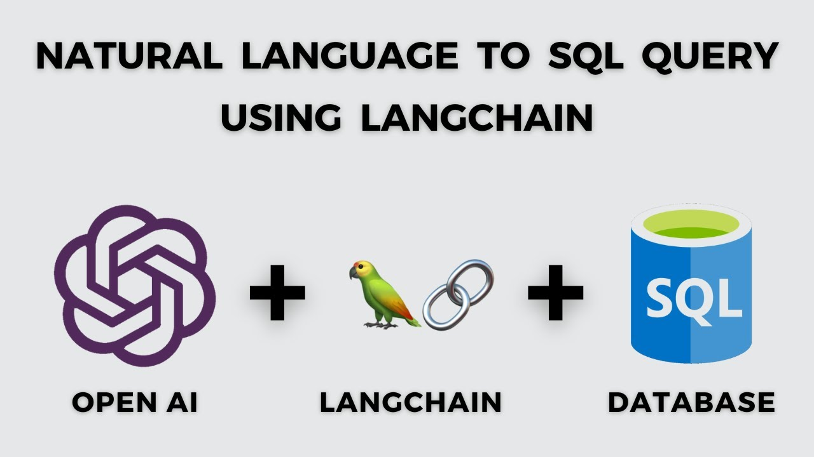
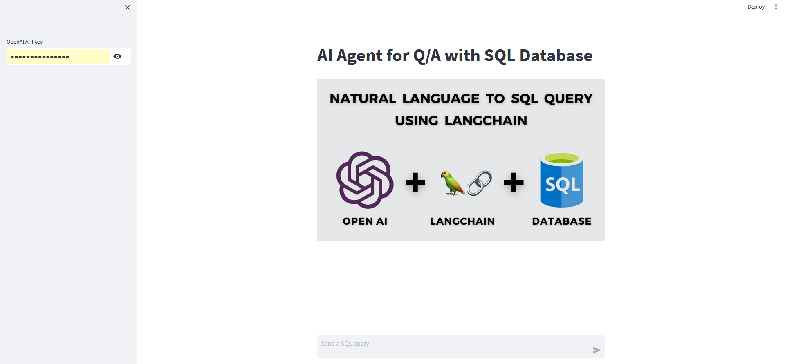
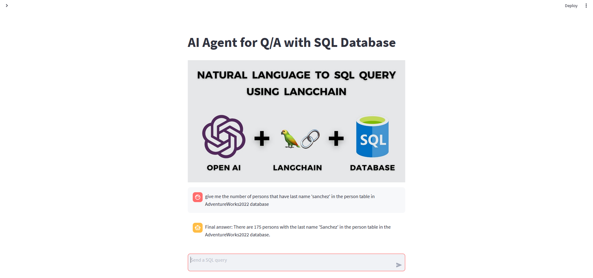

# AI Database Query Agent



## Overview

The AI Database Query Agent is an intelligent assistant that allows you to interact with your SQL database using natural language input. It leverages advanced natural language processing (NLP) techniques to understand and execute SQL queries based on your spoken or written instructions.

With this AI agent, you can:

- Seamlessly interact with your database without the need for complex SQL syntax.
- Retrieve data from your database by asking questions in plain English.
- Speed up your data analysis and reporting tasks with conversational SQL queries.

## Features

- **Natural Language Processing (NLP):** The agent uses NLP to understand your questions and convert them into SQL queries.

- **Database Compatibility:** It supports a wide range of SQL databases, making it versatile for various data sources.

- **Interactive Conversations:** Engage in interactive conversations with the AI agent, refining your queries and getting the data you need.

- **Secure and Private:** Your database credentials and queries are kept secure and private.

## Getting Started

To get started with the AI Database Query Agent, follow these steps:

# Installation

Follow these steps to install and set up the AI Database Query Agent on your system:

## Prerequisites

Before you begin, ensure you have the following prerequisites installed on your system:

- [Python](https://www.python.org/downloads/) (version 3.6 or higher)
- [pip](https://pip.pypa.io/en/stable/installation/) (Python package manager)

**_NOTE:_**    After this you would want to set the Database server credentials.
            As I am using my localhost computer server.

## Step 1: Clone the Repository
```bash
git clone git@github.com:PearlThoughts/Adventure-Works-Kaushal.git
```
## Step 2: Install the dependencies

```bash
pip install -r requirements.txt
```

## Step 3: Execute the following command to run the app

```bash
streamlit run App.py
```
# Execution

## Before Entering the OpenAI Api Key
### You can get your api key from [here](https://openai.com/product)



## Running the Query 


## License

This project is licensed under the [MIT License](LICENSE.md).